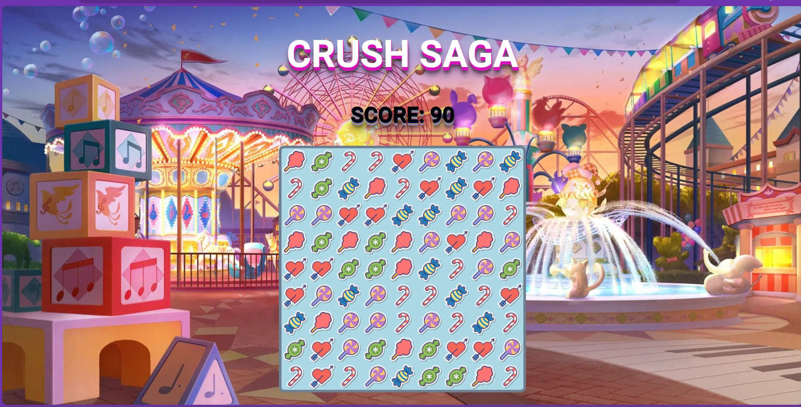

# Crush Saga

Crush Saga is a fun and addictive match-three game inspired by Candy Crush. Swap adjacent candies to make a row or column of three or more matching candies, and watch them disappear as you earn points. With colorful graphics and engaging gameplay, Crush Saga is sure to keep you entertained for hours!

## Features
- Match-three gameplay: Swap candies to make matches and earn points.
- Colorful graphics: Enjoy vibrant colors and animations.

## How to Play
1. Swap adjacent candies to make a row or column of three or more matching candies.
2. Earn points and stars based on your performance.

## Technologies Used
- HTML
- CSS
- JavaScript

## How to Run the Game Locally
1. Clone this repository to your local machine.
2. Open the `index.html` file in your web browser.
3. Start playing Crush Saga!

## Demo
[Play Crush Saga](https://sithumsankajith.github.io/crush-saga/)

